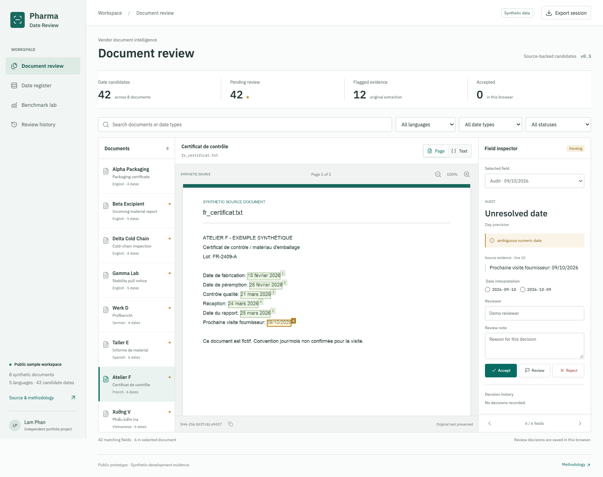
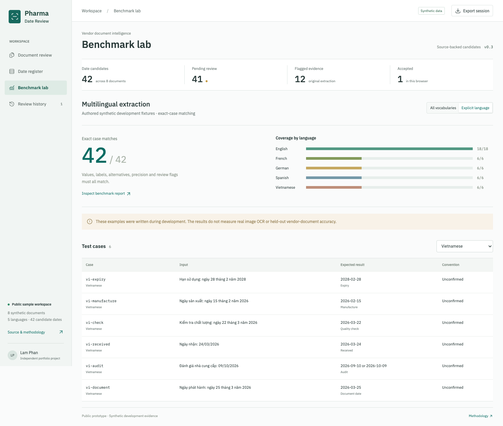
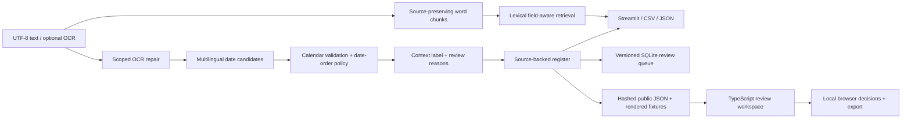

# Pharma Date Review

[](https://github.com/gitLamHoang/pharma-ocr-date-rag/actions/workflows/tests.yml)
[](https://github.com/gitLamHoang/pharma-ocr-date-rag/actions/workflows/pages.yml)
[](pyproject.toml)
[](LICENSE)

A multilingual document review prototype that turns pharmaceutical-style vendor text into a searchable date register, with source evidence and explicit uncertainty.

**English / French / German / Spanish / Vietnamese. Python + TypeScript + SQL.**

### [Open the Interactive Workspace](https://gitlamhoang.github.io/pharma-ocr-date-rag/)

No installation or API key. Inspect eight synthetic documents, review 42 candidate dates, and explore the benchmark evidence.



## The Problem

A vendor document can contain manufacturing, expiry, inspection, audit, arrival, and report dates. Finding a date is only part of the task: a reviewer needs to know what it refers to and where it came from. A value such as `09/01/2026` adds another question: which date convention does this document use?

The product hypothesis is a review workspace for supplier-quality teams: collect candidate fields, surface uncertainty, and keep every result traceable to the source. Customer demand and time savings have not yet been measured. [Product and engineering decisions](docs/design.md).

## Try It

The [browser workspace](https://gitlamhoang.github.io/pharma-ocr-date-rag/) opens directly to document review. Select the French audit date, compare its two interpretations, record a reason, and inspect the decision in Review history. The Date register has language, date-type, status and search filters. Benchmark lab exposes the individual synthetic test cases.

The public browser app uses a versioned snapshot generated by the Python extractor. Review events stay in your browser, can be exported, and are not sent to a server. It does not upload documents or run OCR in the browser. Source-page images are rendered fixtures; their highlights come from text offsets and font layout, not OCR-detected boxes.

### Run locally

```bash
git clone https://github.com/gitLamHoang/pharma-ocr-date-rag.git
cd pharma-ocr-date-rag
python3 -m venv .venv
source .venv/bin/activate
pip install -e ".[dev,demo]"
streamlit run demo_app.py
```

Streamlit is the local extraction sandbox for pasted/uploaded UTF-8 text, language settings and numeric date conventions. The Python CLI and extraction core have no third-party runtime dependencies; Streamlit is optional.

To run the custom browser UI locally with Node 24.12+:

```bash
cd web
npm ci
npm run dev
```

[Two-minute demo walkthrough](docs/demo_walkthrough.md) · [Architecture](docs/architecture.md) · [Product decisions](docs/design.md) · [Portfolio guide](docs/portfolio-guide.md)

## What Works Today

| Capability | Current implementation |
| --- | --- |
| Multilingual fields | Language-specific month names and field vocabularies for English, French, German, Spanish and Vietnamese; all-language or explicit-language mode |
| Date normalization | ISO, numeric, named-month, Vietnamese `ngày … tháng … năm …`, and month/year dates; calendar validation |
| Ambiguity handling | Two valid numeric interpretations produce `normalized: null` plus candidates; explicit conventions can differ by document in one batch |
| Evidence | Original date text, unchanged source character offsets, line number, document text hash, parser settings and review reasons |
| Browser workspace | Source-page highlights and zoom, field inspector, explicit date interpretations, reasoned decisions, local history, register filters and CSV/JSON exports |
| Local extraction UI | Streamlit sandbox for sample collections, pasted/uploaded UTF-8 text, per-document numeric conventions and source highlighting |
| Persistent review | SQLite document versions, parameterized queries, append-only review events, active queue, atomic indexing and tested schema migration |
| Retrieval | Bounded word chunks, exact source slices, lexical ranking with shared date-field vocabulary across languages, and no-match responses |
| Evaluation | Per-label precision/recall/F1, multilingual exact-case checks, chunk-size experiments and automated tests |
| Image OCR experiment | Explicit Tesseract packs, missing-dependency diagnostics and six measured synthetic image inputs in English, French and Vietnamese |

The language setting controls recognized vocabulary, not numeric date order. A French or English document can still have an unconfirmed numeric convention. Month-only expiry dates stay month-only; no day is invented.

### Example: preserve uncertainty

```python
from pharma_ocr_date_rag.dates import extract_dates

hit = extract_dates("Date de péremption: 09/10/2026", language="fr")[0]
assert hit.label == "expiry"
assert hit.normalized is None
assert hit.candidates == ("2026-09-10", "2026-10-09")

resolved = extract_dates("Date de péremption: 09/10/2026", language="fr", date_order="dmy")[0]
assert resolved.normalized == "2026-10-09"
```



## Command Line

```bash
# Inspect multilingual fields, keeping ambiguous dates unresolved
pharma-date-rag extract data/multilingual_docs

# Export evidence with an explicitly chosen date convention
pharma-date-rag extract data/multilingual_docs --date-order dmy --format json

# Search French date fields with an English field term
pharma-date-rag ask data/multilingual_docs --question "expiry"

# Original English sample demo
python scripts/run_demo.py
```

CSV and JSON use the same extractor records as the demos. JSON retains nulls, candidate lists and original text. CSV prefixes formula-like text cells with an apostrophe for spreadsheet export. Source offsets are zero-based, end-exclusive Unicode character positions in decoded text.

### Mixed document conventions

Folder commands accept `--date-order-map`, a JSON object mapping exact filenames to `auto`, `dmy` or `mdy`. A per-document entry overrides the batch `--date-order`; missing entries inherit it. An explicit `auto` keeps that file's numeric convention unconfirmed, even when the batch default is DMY or MDY. Unknown filenames and malformed maps fail before processing.

```bash
pharma-date-rag extract data/mixed_conventions --date-order-map data/mixed_conventions/date_orders.json --format json
```

In the three authored examples, `09/10/2026` becomes September 10 for one file, October 9 for another, and stays unresolved for the third. The effective setting is visible in reports and exports. The same map works with `ask` and `index`; Streamlit has document-specific controls and a **Mixed conventions** collection. [Policy contract and walkthrough](docs/date-conventions.md).

### Persistent local review

```bash
pharma-date-rag index data/multilingual_docs --db work/reviews.sqlite --collection multilingual
pharma-date-rag queue --db work/reviews.sqlite --label expiry
# Replace 1 with a candidate ID returned by the queue
pharma-date-rag review 1 --db work/reviews.sqlite --decision needs_review --reviewer demo --reason "Confirm source convention"
pharma-date-rag history 1 --db work/reviews.sqlite
```

Indexing the same source and parser settings retains its candidate IDs and decisions. A source or setting change creates a separate version. An unresolved SQL candidate cannot be accepted: confirm the source convention, then reindex with `--date-order dmy` or `mdy`. The browser's local review session and the CLI's SQLite database are separate stores; there is no synchronization or authenticated multi-user service.

## Reproduce the Results

```bash
pytest
python scripts/evaluate.py
python scripts/benchmark_multilingual.py --check
python scripts/benchmark_multilingual.py --json
python scripts/benchmark_retrieval.py
python scripts/export_evidence.py --check
python scripts/export_web.py --check
```

Measured on the current **authored synthetic development fixtures**, not held-out vendor documents or image OCR:

| Evaluation | Result | Meaning |
| --- | --- | --- |
| Original English set | 18/18 unique field records; precision/recall/F1 1.00 | Four text documents, explicitly MDY |
| Multilingual + edge cases | 42/42 exact cases in all-language mode and 42/42 in explicit mode | Date, label, candidates, precision and review reasons must all match |
| Multilingual breakdown | EN 18/18; FR, DE, ES, VI each 6/6 | English includes 12 edge cases; coverage is intentionally uneven |
| Retrieval chunk experiment | 3/3 questions hit at 35, 60 and 90 words | A small smoke benchmark, not evidence that chunk size never matters |

[Machine-readable benchmark report](docs/benchmark_results.json) includes the fixture SHA-256. The regression suite covers calendar validation, source preservation, retrieval, exports, Streamlit interactions, SQL migrations and rollback, and snapshot reproducibility. Python CI covers 3.9, 3.11 and 3.12. Browser CI runs type checking, nine unit tests, a production build and Playwright desktop/mobile checks before deploying.

```bash
cd web
npm test
npm run build
npx playwright install chromium
npm run test:browser
```

The browser test starts and stops its own production preview, checks all eight page assets, exercises review persistence and exports, and captures screenshots. See [contributing](CONTRIBUTING.md) for snapshot regeneration and dependency details.

### Separate image-OCR experiment

Actual Tesseract recognition of three synthetic pages recovered **16/16 fields on clean images**, but only **8/16 after fixed downsampling, blur and rotation**, with four extra predictions. All six recognition runs completed. Some errors produced valid-looking but wrong dates, which is why calendar validation is insufficient for automatic acceptance.

The experiment uses pinned English, French and Vietnamese language packs, manually specified gold, occurrence-aware scoring and saved raw OCR output. It does not establish real-scan accuracy or change the text-backed browser demo. [Protocol, failure examples and reproduction commands](docs/image-ocr.md) · [Measured JSON report](reports/image_ocr.json).

```bash
# Check saved evidence without OCR dependencies; this does not rerun recognition
python scripts/benchmark_ocr.py --check-report
```

## Architecture



```text
src/pharma_ocr_date_rag/
  languages.py   month names and field vocabularies
  dates.py       date candidates, normalization, source offsets, review flags
  policies.py    explicit per-document numeric conventions and validation
  ocr.py         verified Tesseract adapter; unverified legacy PaddleOCR adapter
  pipeline.py    shared text/document processing
  reporting.py   evidence records and portable exports
  rag.py         source-preserving chunks and lexical retrieval
  evaluation.py  per-label field metrics
  experiments.py chunk-size evaluation
  review.py      versioned SQLite queue and decisions
  schema.sql     constraints, indexes, view and event triggers
  migrate_v1.sql history-preserving schema upgrade
  cli.py         extraction, search and review commands

data/
  synthetic_docs/       four original English fixtures
  multilingual_docs/    four multilingual demo documents
  mixed_conventions/    three adversarial convention fixtures and a policy map
  multilingual_cases.json
  ocr_cases.json         manual gold for three synthetic image-OCR pages
  ocr_models.json        pinned Tesseract language packs and SHA-256 checksums

web/            TypeScript/Vite app, rendered pages and browser tests
demo_app.py     local Streamlit extraction sandbox
scripts/
tests/
docs/
```

## Scope and Limitations

This is an independent public prototype using only synthetic data. It contains no Pfizer-confidential documents, patient records, real vendor data, or production deployment results. It is a later public reconstruction of the document-workflow idea, not a release of an employer's system. Development uses AI coding assistance; the code, tests and design notes are available for inspection.

The five-language demo starts from text. A separate Tesseract experiment has been run on three synthetic pages in English, French and Vietnamese, both clean and degraded. It does not validate German/Spanish OCR, mixed-language scans, complex layouts or real vendor documents. The PaddleOCR adapter remains unverified. Optional OCR packages and system dependencies are not required for the demo.

Despite the historical repository name, the current retrieval output is extractive evidence, not an LLM-generated answer. There is no trained model, working LlamaIndex index, or Mistral/Phi-2 benchmark in this public version. Those comparisons must be implemented and measured before being claimed.

Field classification and multilingual retrieval use small transparent vocabularies. Unknown phrasing, decomposed Unicode, document tables, page layout and complex mixed-language scans need more coverage. Label confidence is a rule heuristic, not a calibrated probability. Reviewer names are local labels, not verified identities; neither review store is a regulatory approval or clinical decision system.

## Development

See the [daily roadmap](docs/roadmap.md) and [failure-mode notes](docs/failure_modes.md). Contributions should include a minimal synthetic example, expected behavior and a regression check. Report what was actually tested and keep benchmark scope explicit.
