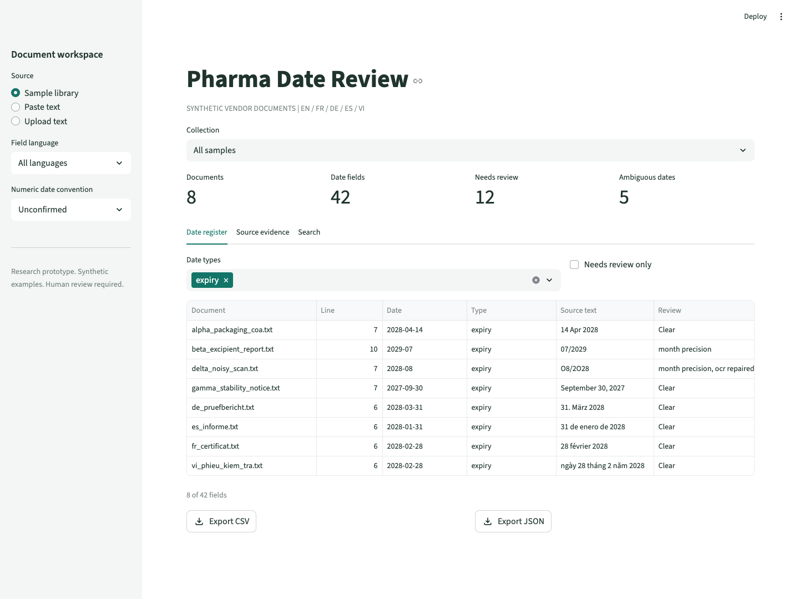
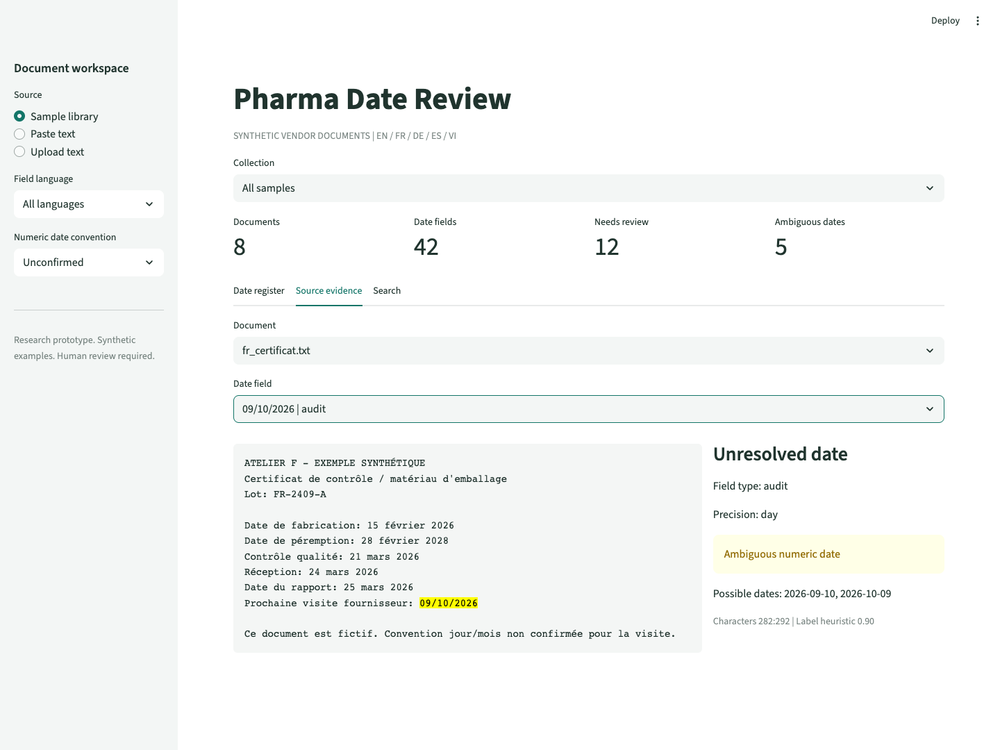
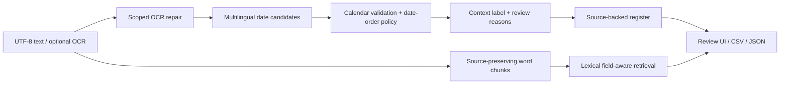

# Pharma Date Review

[](https://github.com/gitLamHoang/pharma-ocr-date-rag/actions/workflows/tests.yml)
[](pyproject.toml)
[](LICENSE)

A multilingual document review prototype that turns pharmaceutical-style vendor text into a searchable date register, with source evidence and explicit uncertainty.

**English / French / German / Spanish / Vietnamese. Local processing. Reproducible evaluation.**



## The Problem

A vendor document can contain manufacturing, expiry, inspection, audit, arrival, and report dates. Finding a date is only part of the task: a reviewer needs to know what it refers to and where it came from. A value such as `09/01/2026` adds another question: which date convention does this document use?

The product hypothesis is a review workspace for supplier-quality teams: collect candidate fields, surface uncertainty, and keep every result traceable to the source. Customer demand and time savings have not yet been measured. [Product and engineering decisions](docs/design.md).

## Try It

```bash
git clone https://github.com/gitLamHoang/pharma-ocr-date-rag.git
cd pharma-ocr-date-rag
python3 -m venv .venv
source .venv/bin/activate
pip install -e ".[dev,demo]"
streamlit run demo_app.py
```

Open the local URL printed by Streamlit. The first screen contains eight synthetic documents across five languages. No API key or model download is needed. The Python CLI and extraction core have no third-party runtime dependencies; Streamlit is optional.

[Two-minute demo walkthrough](docs/demo_walkthrough.md) · [Architecture and decisions](docs/design.md) · [Development roadmap](docs/roadmap.md)

## What Works Today

| Capability | Current implementation |
| --- | --- |
| Multilingual fields | Language-specific month names and field vocabularies for English, French, German, Spanish and Vietnamese; all-language or explicit-language mode |
| Date normalization | ISO, numeric, named-month, Vietnamese `ngày … tháng … năm …`, and month/year dates; calendar validation |
| Ambiguity handling | Two valid numeric interpretations produce `normalized: null` plus candidates; the reviewer can choose DMY or MDY |
| Evidence | Original date text, unchanged source character offsets, line number, document text hash, parser settings and review reasons |
| Review UI | Sample collections, pasted/uploaded UTF-8 text, date-type filters, review-only view, source highlighting, and CSV/JSON downloads |
| Retrieval | Bounded word chunks, exact source slices, lexical ranking with shared date-field vocabulary across languages, and no-match responses |
| Evaluation | Per-label precision/recall/F1, multilingual exact-case checks, chunk-size experiments and automated tests |

The language setting controls recognized vocabulary, not numeric date order. A French or English document can still have an unconfirmed numeric convention. Month-only expiry dates stay month-only; no day is invented.

### Example: preserve uncertainty

```python
from pharma_ocr_date_rag.dates import extract_dates

hit = extract_dates("Date de péremption: 09/10/2026", language="fr")[0]
assert hit.label == "expiry"
assert hit.normalized is None
assert hit.candidates == ("2026-09-10", "2026-10-09")

resolved = extract_dates(
    "Date de péremption: 09/10/2026", language="fr", date_order="dmy"
)[0]
assert resolved.normalized == "2026-10-09"
```



## Command Line

```bash
# Inspect multilingual fields, keeping ambiguous dates unresolved
pharma-date-rag extract data/multilingual_docs

# Export evidence with an explicitly chosen date convention
pharma-date-rag extract data/multilingual_docs --date-order dmy --format json

# Search French date fields with an English field term
pharma-date-rag ask data/multilingual_docs --question "expiry"

# Original English sample demo
python scripts/run_demo.py
```

CSV and JSON use the same records as the demo. JSON retains nulls, candidate lists and original text. CSV prefixes formula-like text cells with an apostrophe for spreadsheet export. Source offsets are zero-based, end-exclusive positions in decoded text. Image coordinates are not yet available.

## Reproduce the Results

```bash
pytest
python scripts/evaluate.py
python scripts/benchmark_multilingual.py --check
python scripts/benchmark_multilingual.py --json
python scripts/benchmark_retrieval.py
```

Measured on the current **authored synthetic development fixtures**, not held-out vendor documents or image OCR:

| Evaluation | Result | Meaning |
| --- | --- | --- |
| Original English set | 18/18 unique field records; precision/recall/F1 1.00 | Four text documents, explicitly MDY |
| Multilingual + edge cases | 42/42 exact cases in all-language mode and 42/42 in explicit mode | Date, label, candidates, precision and review reasons must all match |
| Multilingual breakdown | EN 18/18; FR, DE, ES, VI each 6/6 | English includes 12 edge cases; coverage is intentionally uneven |
| Retrieval chunk experiment | 3/3 questions hit at 35, 60 and 90 words | A small smoke benchmark, not evidence that chunk size never matters |

[Machine-readable benchmark report](docs/benchmark_results.json) includes the fixture SHA-256. The regression suite covers invalid calendar dates, leap years, source-position preservation, false-positive lot identifiers, empty retrieval, exports, demo interactions and script entry points. With demo dependencies installed, the current suite contains 110 tests. CI runs on Python 3.9 and 3.11.

## Architecture



```text
src/pharma_ocr_date_rag/
  languages.py   month names and field vocabularies
  dates.py       date candidates, normalization, source offsets, review flags
  ocr.py         optional legacy Tesseract/PaddleOCR adapters
  pipeline.py    shared text/document processing
  reporting.py   evidence records and portable exports
  rag.py         source-preserving chunks and lexical retrieval
  evaluation.py  per-label field metrics
  experiments.py chunk-size evaluation
  cli.py         extraction and search commands

data/
  synthetic_docs/       four original English fixtures
  multilingual_docs/    four multilingual demo documents
  multilingual_cases.json

demo_app.py
scripts/
tests/
docs/
```

## Scope and Limitations

This is an independent public prototype using only synthetic data. It contains no Pfizer-confidential documents, patient records, real vendor data, or production deployment results. It is a later public reconstruction of the document-workflow idea, not a release of an employer's system. Development uses AI coding assistance; the code, tests and design notes are available for inspection.

The tested multilingual path starts from text. Tesseract and PaddleOCR adapters exist for optional image input, but image OCR, non-English OCR language packs, and OCR engine accuracy have not been validated in this version. They are not required for the demo.

Despite the historical repository name, the current retrieval output is extractive evidence, not an LLM-generated answer. There is no trained model, working LlamaIndex index, or Mistral/Phi-2 benchmark in this public version. Those comparisons must be implemented and measured before being claimed.

Field classification and multilingual retrieval use small transparent vocabularies. Unknown phrasing, decomposed Unicode, document tables, page layout and complex mixed-language scans need more coverage. Label confidence is a rule heuristic, not a calibrated probability. Review flags identify cases to inspect; they do not constitute an approval workflow or a clinical decision.

## Development

See the [daily roadmap](docs/roadmap.md) and [failure-mode notes](docs/failure_modes.md). Contributions should include a minimal synthetic example, expected behavior and a regression check. Report what was actually tested and keep benchmark scope explicit.
