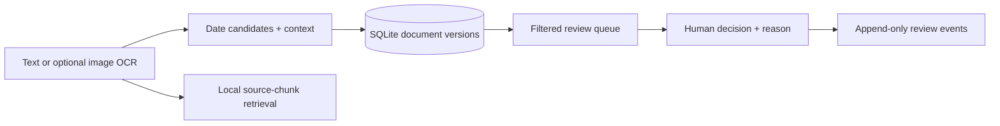

# Document Date Review

[](https://github.com/gitLamHoang/pharma-ocr-date-rag/actions/workflows/ci.yml)

**Turn scattered document dates into a traceable review queue.** A local Python + SQL prototype for finding expiry, manufacturing, audit, and QA dates, retrieving their source context, and recording a person's decision against the exact document version.

The product hypothesis: a reviewer should spend less time finding dates and more time checking ambiguous evidence. The public demo uses **four synthetic text documents**. It has no real customer documents, deployment claims, or measured time savings.

[Try it in two minutes](#try-it) · [Measured evidence](#what-is-measured) · [Architecture and scaling](docs/architecture.md) · [Failure modes](docs/failure_modes.md)

## What you can do

1. **Extract** candidate dates and context from text; optional adapters handle images.
2. **Retrieve** relevant source chunks with a local, deterministic keyword baseline.
3. **Review** candidates in a persistent SQLite queue with collection and label filters.
4. **Trace** each decision to a content hash. Reindexing an unchanged file preserves its reviews; changing it creates a new version.



## Try it

Use Python 3.12 and [uv](https://docs.astral.sh/uv/). The default path needs no API key, model download, OCR installation, or external service.

```bash
git clone https://github.com/gitLamHoang/pharma-ocr-date-rag.git
cd pharma-ocr-date-rag
uv sync --frozen --python 3.12 --extra dev
uv run pharma-date-rag index data/synthetic_docs --collection demo
uv run pharma-date-rag queue --collection demo --label expiry
```

A fresh database reports **4 indexed documents and 18 date candidates**. One expiry candidate looks like this; IDs depend on the database:

```json
{
  "id": 2,
  "normalized": "2028-04-14",
  "label": "expiry",
  "context": "Expiry Date: 14 Apr 2028",
  "path": "alpha_packaging_coa.txt",
  "decision": "pending"
}
```

Use an ID returned by `queue` to record a decision and inspect its history:

```bash
uv run pharma-date-rag review 2 --decision accepted --reviewer demo-reviewer \
  --reason "Matched date to the synthetic source text"
uv run pharma-date-rag history 2
uv run pharma-date-rag index data/synthetic_docs --collection demo
```

The second index reports **4 unchanged documents and 0 new candidates**. Accepted entries leave the pending queue; `--decision all` includes every active candidate. Other decisions are `rejected` and `needs_review`.

The default database is ignored at `outputs/review.sqlite`. Pass `--db PATH` to any review command to use another database. Collections separate source folders; use a distinct `--collection` for each folder. Listing supports `--limit` (1–1,000), `--offset`, `--label`, and `--collection`.

Try retrieval:

```bash
uv run pharma-date-rag ask data/synthetic_docs \
  --question "Which document mentions the Delta expiry date?"
uv run pharma-date-rag extract data/synthetic_docs
```

The answer contains filenames, source snippets, candidate dates, and retrieval scores. There is **no generative model in this baseline**; the repository's original OCR/RAG name reflects its broader exploration.

Optional Streamlit viewer:

```bash
uv sync --frozen --python 3.12 --extra demo
uv run streamlit run demo_app.py
```

The viewer exposes extraction and retrieval. Persistent review currently runs through the CLI. Image OCR adapters are optional and are **not validated by the text-only evaluation below**.

## What is measured

[Checked-in results with input and source hashes](reports/synthetic_evaluation.json) are regenerated from the public fixtures. These fixtures were used while building the extractor: they are a reproducibility check, **not an independent generalization estimate**.

| Check | Measured result | Scope |
|---|---:|---|
| Date extraction | 18/18 expected tuples matched; precision, recall, F1 = 1.00 | Four synthetic text documents; exact `(document, normalized date, label)` match |
| Retrieval, 35-word chunk target | 2/3 questions hit in top 3 | A hit requires the expected document and date label |
| Retrieval, 60- or 90-word chunk target | 3/3 questions hit in top 3 | Same three synthetic questions; insufficient to select a generally best chunk size |
| Review indexing | 4 documents → 18 candidates; repeat → 0 new candidates | Local synthetic CLI run; reviews retained |

The short-chunk experiment missed one query. That is a useful failure: splitting context can remove the signal a reviewer needs. Real document variety, real scan quality, and reviewer usefulness remain unmeasured.

Reproduce:

```bash
uv sync --frozen --python 3.12 --extra dev
uv run python scripts/evaluate.py
uv run python scripts/benchmark_retrieval.py
uv run python scripts/export_evidence.py --check
uv run pytest -q
uv run ruff check .
uv run ruff format --check .
```

CI runs these commands. Tests cover extraction, retrieval, CLI behavior, idempotency, version reactivation, batch rollback, concurrent source changes, pagination, collection isolation, and append-only review events.

## Engineering choices

- **Python** keeps extraction and evaluation inspectable. The core uses only the standard library.
- **SQL + SQLite** provide transactions, foreign keys, indexed version lookup, one active version per source, and durable review history. A failed indexing batch rolls back its document and candidate changes.
- **Content hashes and extractor versions** separate new source evidence from earlier review decisions. See [version semantics](docs/architecture.md#version-and-review-semantics).
- **Local execution** makes the example cheap to reproduce. [The scaling plan](docs/architecture.md#scaling-boundary) specifies when to introduce workers, object storage, and a service database.

## Limits and next experiment

Dates and labels are candidates for human review. Heuristic confidence is not calibrated probability. Numeric date ambiguity, OCR repairs, month-only dates, and nearby labels can change interpretation. Missing files are retained in the database until an explicit future retirement workflow exists. SQLite triggers prevent ordinary event updates and deletes; a database owner can still modify the schema or file.

This prototype has no access control, authenticated reviewer identity, compliance validation, or clinical/release-decision function. The next product experiment is to observe reviewers on a consented, independently labeled document set and measure correction rate and review time against manual lookup. No such user study has been completed.

Built by [Lam Phan](https://github.com/gitLamHoang). Contributions: see [CONTRIBUTING.md](CONTRIBUTING.md). License: [MIT](LICENSE).
