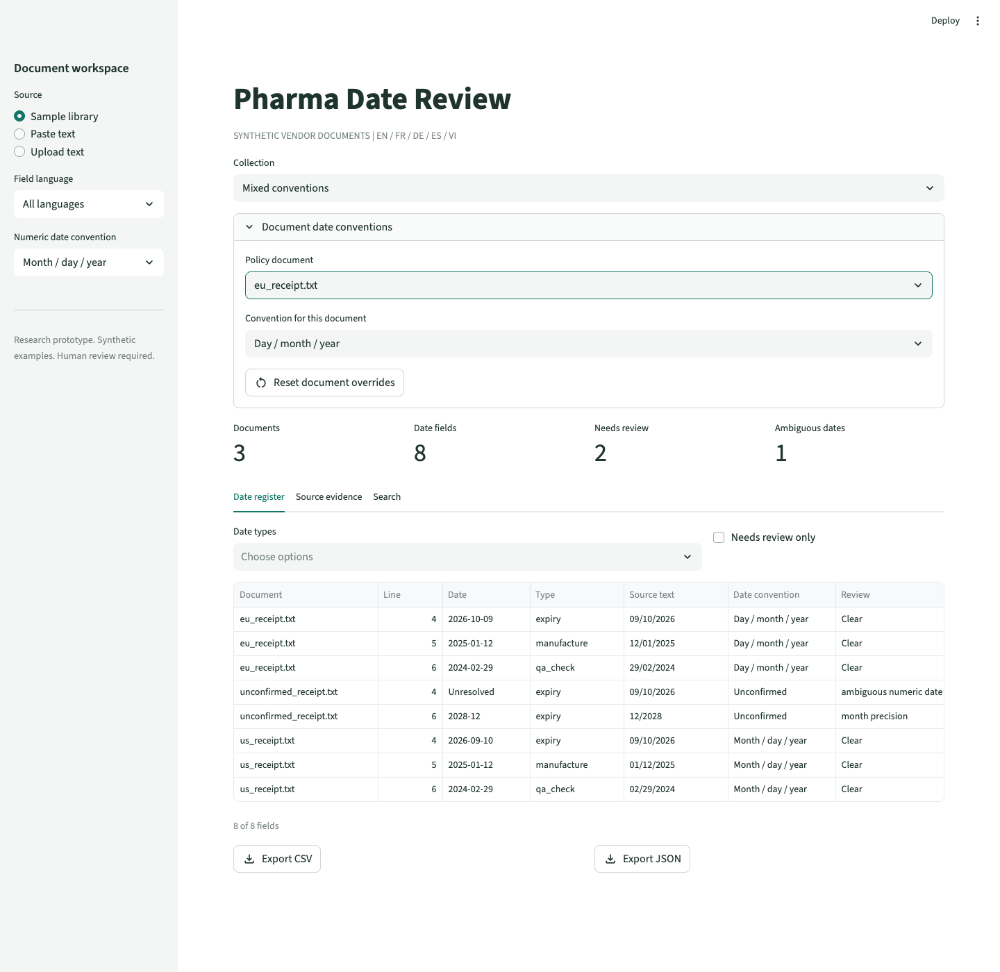

# Per-Document Date Conventions

A folder can contain day-first and month-first documents, including two English documents using different conventions. Neither the language nor a country-looking filename is proof of numeric order. The parser does not detect convention declarations in document text; the caller must confirm the convention and select it explicitly.

## Reproduce the Mixed Batch

Three synthetic text fixtures demonstrate the distinction:

| Document | Explicit policy | Source token | Result |
| --- | --- | --- | --- |
| `us_receipt.txt` | `mdy` | `09/10/2026` | `2026-09-10` |
| `eu_receipt.txt` | `dmy` | `09/10/2026` | `2026-10-09` |
| `unconfirmed_receipt.txt` | `auto` | `09/10/2026` | null; both alternatives retained |

The first two fixtures declare their authoring conventions; the third does not. The checked-in map is a manual interpretation of those declarations, not an inference from the filenames. The samples also include a leap-day check, an intentionally impossible `31/02/2026`, and a month-only expiry. An invalid full date must not be partially accepted as a valid month/year suffix. Invalid dates are currently omitted rather than emitted as separate invalid-field records.

```bash
pharma-date-rag extract data/mixed_conventions
pharma-date-rag extract data/mixed_conventions --date-order-map data/mixed_conventions/date_orders.json --format json
pharma-date-rag ask data/mixed_conventions --date-order-map data/mixed_conventions/date_orders.json --question expiry
pharma-date-rag index data/mixed_conventions --date-order-map data/mixed_conventions/date_orders.json --db work/mixed-reviews.sqlite
```

Both extraction runs produce eight date candidates. Without confirmed policies, five are unresolved. With the explicit map, one remains unresolved. This measures policy application to authored fixtures, not improved model accuracy or automatic convention detection.

## Map Contract

The CLI accepts a UTF-8 JSON object with exact, case-sensitive filenames as keys and `auto`, `dmy` or `mdy` as values. UTF-8 BOM is accepted. Paths, duplicate JSON keys, unsupported orders, and entries not found among supported files in the selected folder fail before extraction or database mutation.

```json
{
  "us_receipt.txt": "mdy",
  "eu_receipt.txt": "dmy",
  "unconfirmed_receipt.txt": "auto"
}
```

An omitted filename inherits `--date-order`, which defaults to `auto`. An explicit `auto` overrides even a resolved batch default. It means "do not impose a convention," not "detect one using language." A token with only one calendar-valid interpretation can still normalize under `auto`.

Text reports print the effective convention in the document header. CSV/JSON retain it in each field's `date_order`. Retrieval chunks carry the same setting. The SQLite `extractor_version` includes the effective language and order for each document, as it did before map support.

The map is read once per command. It is not an authenticated policy record, does not store a confirmation reason, and is not watched for edits during a run. Archive the input map separately when its provenance matters. Equivalent effective settings reuse the same version whether they came from a batch default or a per-document entry.

## Local UI

In Streamlit, select **Mixed conventions**, expand **Document date conventions**, and select a policy document. Choose its convention; inspect the effective setting in the register and source-evidence tab. Overrides survive switching documents and collections within the session. **Reset document overrides** restores the workspace default. An explicit **Unconfirmed** override remains unconfirmed even when the workspace default is DMY or MDY.



The browser-hosted portfolio app still uses its fixed eight-document snapshot and separate per-field review decisions. It does not run the Python parser or apply folder policy maps. Streamlit's overrides are session settings, not browser-review events or a synchronized SQL policy store.

## Review Version Semantics

Changing one document's effective order creates a new version only for that document. Its earlier candidate IDs and decisions remain in history and cannot be newly reviewed while inactive. Unaffected documents keep their IDs and decisions. Returning to an earlier content/settings version reactivates its earlier reviews, following the existing reuse policy; it does not start a new review cycle.

Tests cover mixed orders, explicit unconfirmed settings, sparse defaults, calendar adversaries, retrieval propagation, exports, malformed/duplicate/stale map entries, unchanged versions, policy changes, reactivation, atomic batch rollback, and UI switching/reset behavior.
