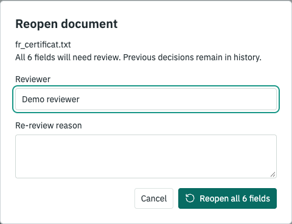

# Review Lifecycle

An unchanged document can need another inspection. A withdrawn source should not return to the queue during routine indexing. These are explicit reviewer actions, separate from source extraction.

## Local SQLite Workflow

Start with synthetic fixtures and inspect the document IDs:

```bash
pharma-date-rag index data/multilingual_docs --db outputs/lifecycle.sqlite --collection demo
pharma-date-rag documents --db outputs/lifecycle.sqlite --collection demo --state all
```

The commands below use document version `1`. Replace it with an ID from `documents`, not a field ID from `queue`.

```bash
pharma-date-rag document reopen 1 --db outputs/lifecycle.sqlite --reviewer demo --reason "Repeat source inspection"
pharma-date-rag queue --db outputs/lifecycle.sqlite --decision needs_review
pharma-date-rag document retire 1 --db outputs/lifecycle.sqlite --reviewer demo --reason "Source withdrawn from this collection"
pharma-date-rag index data/multilingual_docs --db outputs/lifecycle.sqlite --collection demo
pharma-date-rag documents --db outputs/lifecycle.sqlite --state retired
pharma-date-rag document restore 1 --db outputs/lifecycle.sqlite --reviewer demo --reason "Return stored evidence for checking"
pharma-date-rag document-history 1 --db outputs/lifecycle.sqlite
```

| Action | Result | Previous decisions |
| --- | --- | --- |
| Reopen active version | Every field becomes `needs_review` | Preserved; each field gets another decision |
| Retire active source | No source version appears in the active queue | Preserved; no field decision is rewritten |
| Index retired source | File is skipped; `retired_skipped` increases | Preserved, even when content/settings change |
| Restore last retired version | Stored version returns; every field becomes `needs_review` | Preserved, but old acceptances are not current |

Retirement applies to `(collection, filename)`, including its older versions. Other collections and filenames remain independent. Renaming a file creates a different logical source; retirement does not follow content across names.

Restoration reads stored evidence, not the current source file. Index again to detect current file contents and settings. Missing files are not automatic withdrawals. A restored queue entry does not prove that its original file still exists.

`documents --state all` includes zero-field versions and superseded versions. A retired source marks all its versions retired, but only the version in the latest retirement event can be restored. This prevents an old selection from restoring a different version.

`history HIT_ID` retains individual field decisions. `document-history DOCUMENT_ID` retains lifecycle actions and reviewer reasons. Each reopen/restore field reason includes its document event ID. Both event tables reject updates and deletions through SQL triggers.

The action, active-state change and new field decisions commit together. A failed write leaves all three unchanged. Schema v3 adds lifecycle tables/views to v2 without renumbering fields or changing historical decisions. Existing v1 databases pass through the earlier evidence migration in the same transaction.

## Browser Workflow

Open **Document review**, accept the ambiguous French audit date with an explicit interpretation, then select **Reopen document for review**. Confirm a reviewer and reason. All six fields become `Needs review`, even if a filter shows only one.



The audit field returns to `Unresolved date`. Earlier interpretations remain in Review history and session JSON; they are not carried into the new check. Each new field event has a shared `reopenId`. A storage failure leaves the earlier session unchanged.

This action only affects the synthetic browser collection. Public MHRA records remain review-only candidates, with no approval or retirement action. Browser storage and SQLite remain separate.

## Reproduce the Checks

```bash
uv run --extra dev pytest tests/test_review.py tests/test_cli.py -q
cd web
npm test
npm run build
npm run test:browser
```

The browser test requires Playwright Chromium; use `BROWSER_CHANNEL=chrome` with an installed Chrome browser. It checks confirmation, filtered bulk scope, storage failure, history, reload, exports and responsive dialog layouts.

## Limits

Reviewer labels are not authenticated identities. These operations are local workflow controls, not regulatory approvals or tamper-proof audit records. There is no multi-user authorization, cross-tab synchronization, retention policy or clinical validation.

Repeated explicit reopen requests append another set of decisions. This is not an idempotent remote API or a formally assigned review-cycle system. Ordinary non-retired source reversion still reuses prior decisions; request re-review explicitly when needed.
